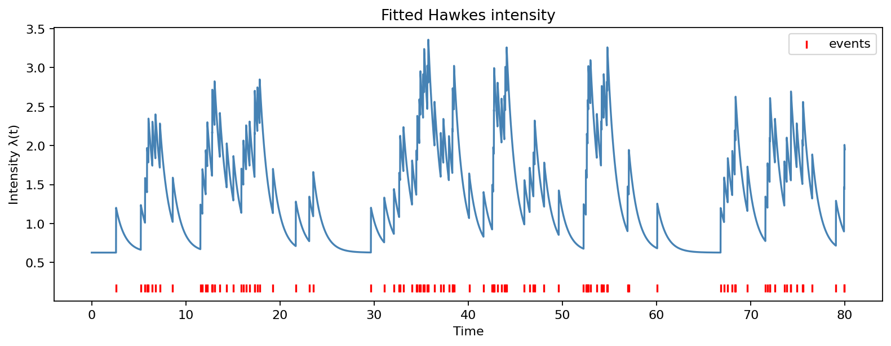

# intensify

[](https://pypi.org/project/intensify/)
[](https://pypi.org/project/intensify/)
[](LICENSE)
[](https://github.com/hillmatt7/intensify/actions/workflows/ci.yml)

A modern Python library for **point processes broadly** — Poisson,
Cox, and Hawkes — with deep Hawkes specialization. Built for
quantitative finance and computational neuroscience, tested on real
spike-train recordings, and Rust-accelerated on the likelihood and simulation
hot paths.

```bash
pip install intensify
```

Binary wheels are published for Linux (x86_64, aarch64), macOS (Intel and
Apple Silicon), and Windows (x86_64) on Python 3.10 – 3.12. Source builds
require a Rust toolchain — install via `pip install 'intensify[fast]'`.

## Quickstart

```python
import numpy as np
import intensify as its

# Simulate event times from a self-exciting process.
model = its.Hawkes(mu=0.6, kernel=its.ExponentialKernel(alpha=0.55, beta=1.4))
events = model.simulate(T=80.0, seed=1)

# Fit μ, α, and β jointly from the observed events.
result = model.fit(events, T=80.0)

print(f"Branching ratio: {result.branching_ratio_:.3f}")
print(f"Log-likelihood:  {result.log_likelihood:.3f}")
print(f"Fitted params:   {result.flat_params()}")

# Visualize fitted intensity and diagnostics
fig = its.plot_intensity(result)
fig.savefig("quickstart_intensity.png", dpi=160)
```

Representative output:

```text
Branching ratio: 0.547
Log-likelihood:  -66.671
Fitted params:   {'mu': 0.6271952244498643, 'alpha': 0.5470266035451343, 'beta': 1.0562059205150198}
```



Other common workflows:

```python
# Multivariate connectivity: estimate directed excitation strengths.
kernels = [
    [its.ExponentialKernel(0.20, 1.0), its.ExponentialKernel(0.05, 1.0)],
    [its.ExponentialKernel(0.10, 1.0), its.ExponentialKernel(0.25, 1.0)],
]
mh = its.MultivariateHawkes(n_dims=2, mu=[0.5, 0.6], kernel=kernels)
mv_events = mh.simulate(T=100.0, seed=4)
mv_result = mh.fit(mv_events, T=100.0, fit_decay=False)
print(mv_result.connectivity_matrix())

# Goodness of fit: time-rescaling theorem residuals.
from intensify.core.diagnostics.goodness_of_fit import time_rescaling_test

ks_stat, p_value = time_rescaling_test(result)
print(f"KS stat={ks_stat:.3f}, p={p_value:.3f}")

# Cox process: latent, time-varying intensity for spike-train style data.
lgcp = its.LogGaussianCoxProcess(n_bins=80, mu_prior=-0.2, sigma_prior=0.6)
spikes = lgcp.simulate(T=10.0, seed=11)
print(len(spikes), "events from an LGCP prior sample")
```

## Features

- **Process families** (full point-process spectrum, not just Hawkes):
  - **Poisson**: `HomogeneousPoisson`, `InhomogeneousPoisson` (callable
    intensity or piecewise-constant rates).
  - **Cox**: `LogGaussianCoxProcess` (LGCP), `ShotNoiseCoxProcess`.
  - **Hawkes**: univariate, multivariate, marked, nonlinear (softplus /
    sigmoid / relu / identity links), multivariate-nonlinear, signed
    (inhibitory).
- **Kernel family**: Exponential, Sum-of-Exponentials, Power-Law, Approximate
  Power-Law (Bacry–Muzy), Nonparametric (piecewise-constant). Every kernel
  is supported in every MLE path.
- **Inference**: MLE with hand-derived closed-form gradients (no autodiff in
  the hot path); recursive `O(N)` likelihood for exponential-family kernels;
  EM and online (streaming) updates route through the same Rust core;
  Bayesian MCMC via numpyro (optional `[bayesian]` extra).
- **Diagnostics**: time-rescaling theorem (KS + QQ on inter-compensator
  increments — the mathematically correct form), AIC/BIC, residual intensity.
- **Simulation**: Ogata thinning (general) and cluster/branching
  (Galton–Watson) — both Rust-backed.
- **Stationarity enforcement**: projected gradient for multivariate Hawkes;
  spectral radius of the kernel-norm matrix reported on every multivariate
  `FitResult`.
- **Architecture**: Rust core (`intensify._libintensify`) for kernel,
  likelihood, gradient, and simulator hot paths. Pure-Python user API.
  Loud `ImportError` if the compiled extension is missing.

## Why intensify?

intensify and [tick][] solve partly overlapping problems. Pick the right
tool:

| Capability | intensify | [tick][] |
|---|---|---|
| Inhomogeneous Poisson (arbitrary rate function or piecewise-constant) | ✓ | partial (sim only) |
| Log-Gaussian Cox Process (LGCP) | ✓ | — |
| Shot-Noise Cox Process | ✓ | — |
| Joint MLE of (μ, α, β) — fits the Hawkes decay for you | ✓ | — (decay must be supplied) |
| MLE for power-law, approx-power-law, nonparametric kernels | ✓ | — |
| Marked Hawkes fit with any kernel | ✓ | — |
| Nonlinear (softplus / sigmoid / relu) Hawkes, signed kernels | ✓ | — |
| Multivariate stationarity enforcement (projected gradient) | ✓ | — |
| Time-rescaling test on inter-compensator increments | ✓ | ✓ |
| Python 3.10 – 3.12 support, prebuilt wheels | ✓ | 3.8 only, C++ build |
| Sub-millisecond fits for exp kernels with known decay | ✓ | ✓ |
| Faster than tick at every benchmarked N (decay-given mv_exp) | ✓ | — |

The benchmark suite builds seeded synthetic Hawkes datasets, fits the same
models repeatedly, and reports median wall time over three runs. The
apples-to-apples tick comparison locks the exponential decay `β`, because
tick requires the user to provide decay up front; intensify also reports
joint-decay runs where it estimates `β` directly. Full methodology and
reproduction commands are in [docs/benchmarks.md](docs/benchmarks.md).
Short version, on the decay-given `mv_exp_5d` problem:

| N | tick (ms) | **intensify 0.3.0b1** (ms) | speedup |
|---:|---:|---:|---:|
| 501 | 1.0 | **0.5** | 2.0× |
| 9,271 | 6.0 | **2.4** | 2.5× |
| 91,249 | 48.0 | **22.2** | 2.2× |

Joint-decay (β fit per cell) — tick can't do this at all — went from
1100 ms to **14 ms** at N=1099 (~80× vs the 0.2.0 JAX baseline). For
kernels tick doesn't ship (power-law, nonparametric, signed, marked,
nonlinear) intensify is the only option. ISSUES.md #8 is fixed: the
nonparametric path now finishes in <1 s at N=500 (previously killed
after 7 minutes). End-to-end, the HC-3 real-spike-train stress suite
(42 tests across every kernel × every process × diagnostics) dropped
from **8m 13s to ~1.3 s** — about 380× faster. [pyhawkes][] is no
longer usable — its transitive deps depend on APIs removed from
SciPy 1.0 in 2017.

[tick]: https://github.com/X-DataInitiative/tick
[pyhawkes]: https://github.com/slinderman/pyhawkes

## Documentation

Full docs: <https://hillmatt7.github.io/intensify>

- [Getting started](docs/getting_started.md)
- User guide: [inference](docs/user_guide/inference.md),
  [kernels](docs/user_guide/kernels.md),
  [simulation](docs/user_guide/simulation.md),
  [diagnostics](docs/user_guide/diagnostics.md),
  [quantitative finance](docs/user_guide/finance.md),
  [computational neuroscience](docs/user_guide/neuroscience.md)
- [API reference](https://hillmatt7.github.io/intensify/api_reference.html)
- [Tutorials](tutorials/) (Jupyter notebooks)

## Citation

If you use intensify in academic work, please cite it:

```bibtex
@software{intensify,
  author = {Hill, Matthew},
  title  = {intensify: A modern Python point process library with deep Hawkes specialization},
  year   = {2026},
  url    = {https://github.com/hillmatt7/intensify}
}
```

See [`CITATION.cff`](CITATION.cff) for the machine-readable form.

## Contributing & changes

- [Contributing guide](CONTRIBUTING.md)
- [Changelog](CHANGELOG.md)
- [Open issues](https://github.com/hillmatt7/intensify/issues)

## License

MIT — see [LICENSE](LICENSE).
